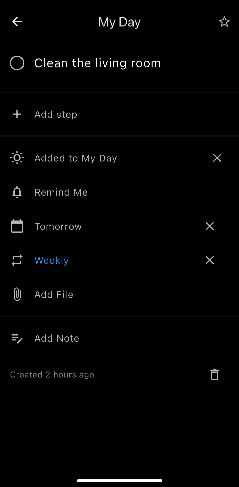

# Flutter Todo App

A simple yet powerful task management app built with Flutter. Currently in active development, with more features coming soon!

**[中文版 / Chinese Version](README_ZH.md)**

---

## Features (Completed)

### 1. **Task List**
 
- View all tasks in one place.  
- Mark tasks as complete with a single tap.  
- Floating action button for quick task creation.  

### 2. **Task Creation & Editing**
 
- Add tasks with title, description, due date, and priority.  
- Edit tasks anytime.  

---

## Upcoming Features (Planned)

- **Task Categories & Grouping**: Organize tasks into custom categories.  
- **Reminders & Notifications**: Set reminders for important tasks.  
- **Data Sync & Backup**: Export and sync tasks across devices.  
- **Themes & Customization**: Switch between light and dark themes.  
- **Search Functionality**: Quickly find tasks by keyword.  

---

## Technical Stack

- **Framework**: Flutter (cross-platform support for iOS and Android).  
- **State Management**: `Provider` for efficient state management.  
- **Local Storage**: `shared_preferences` for storing task data locally.  

---

## How to Get Started

1. Clone the repository:  
   ```bash
   git clone https://github.com/samniu/todo.git

2. Install dependencies:
    ```bash
    flutter pub get

3. Run the app:
    ```bash
    flutter run

## Contribution & Feedback
We welcome contributions! If you have any suggestions or issues, please open an [Issue](https://github.com/samniu/todo/issues) or submit a Pull Request.    

## License
This project is licensed under the MIT License. See the [LICENSE](LICENSE) file for details.